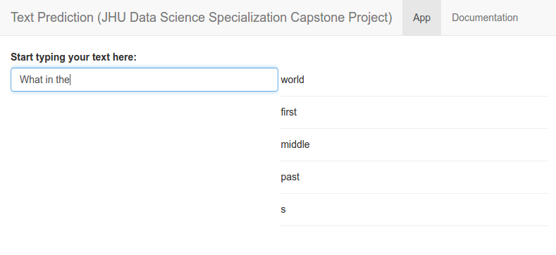

Text Prediction App
========================================================
author: Wagner Pinheiro
date: March, 2017
autosize: true
font-family: 'Helvetica'

JHU Data Science Specialization Capstone Project

The Project
========================================================

This app uses a predictive model using [Markov Chains](https://en.wikipedia.org/wiki/Markov_chain) to suggest the next user word. This model was defined from the analysis of n-grams in a collection of texts extracted from blogs, twitter and news.

The texts dataset used can be accessed [here](https://d396qusza40orc.cloudfront.net/dsscapstone/dataset/Coursera-SwiftKey.zip).

Some Statistics
========================================================

Above you can see a word cloud of twitter analysed text.

For a more detailed statistics see [this report](https://rpubs.com/wagnerpinheiro/jhu-dsc-cap-week2).

The App
========================================================

Test the Shiny App Predict Text: https://wagnerpinheiro.shinyapps.io/predict_text/

Screenshot:

Resources and References
========================================================
* source code: https://github.com/wagnerpinheiro/jhu-dsc-capstone

References

1. https://en.wikipedia.org/wiki/Natural_language_processing
1. http://cran.r-project.org/web/views/NaturalLanguageProcessing.html
1. https://www.coursera.org/course/nlp
1. https://cran.r-project.org/web/packages/quanteda/vignettes/quickstart.html
1. https://cran.r-project.org/web/packages/tidytext/vignettes/tidying_casting.html
