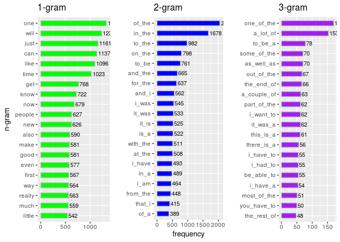
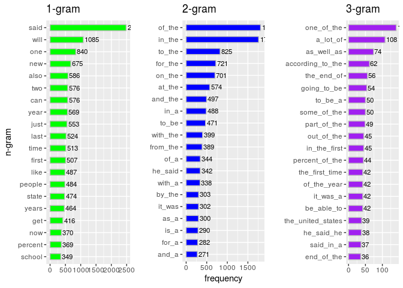
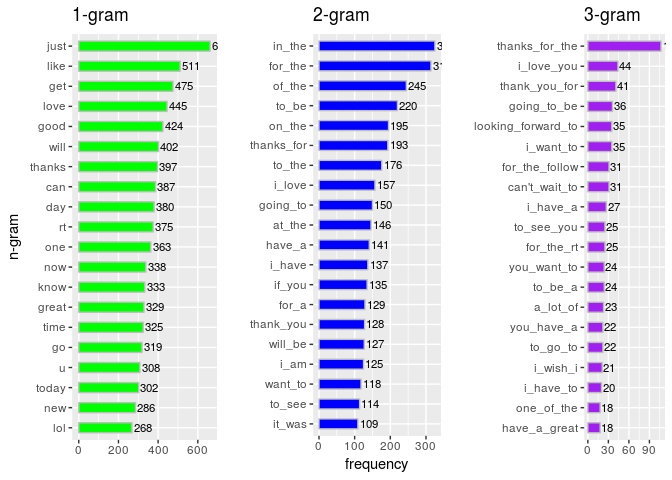
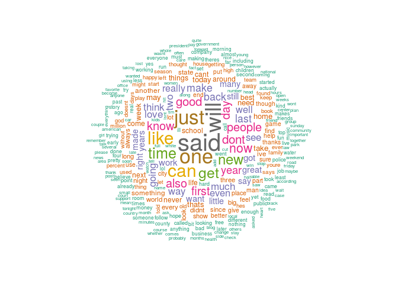

# Data Science Capstone - Week 2 - Milestone Report
Wagner Pinheiro  
February, 2017  


The goal of this project is just to display some statistics about data mining for the data science capstone project, and some insights to create a prediction algorithm app on Shiny.

## Downloaded Datasets

For this project we use some logs of different sources (in different languages), to train and create a prediction algorithm (see the appendix II for more details about the functions used for download the datasets).

### Summary statistics about the data sets

To get some statistics we used the system comand "wc" to count the lines and words in each file (see appendix II for more details).


```r
source("main.R")
files <- dir(".", pattern=".*(blogs|news|twitter).*txt", recursive = T)
infos <- file.info(files)
infos$name <- files
infos$lines <- sapply(files, CAP.fileLinesCount)
infos$words <- sapply(files, CAP.fileWordsCount)
# not calculated the chars count, because is useless in this context
# infos$chars_count <- lapply(files, CAP.fileCharsCount)
kable(select(infos, name, size, lines, words) %>% mutate(size=paste(trunc(size / 1024^2), " MB")))
```


name                                 size      lines     words    
-----------------------------------  --------  --------  ---------
data/final/de_DE/de_DE.blogs.txt     81  MB    371440    12652985 
data/final/de_DE/de_DE.news.txt      91  MB    244743    13216346 
data/final/de_DE/de_DE.twitter.txt   72  MB    947774    11803486 
data/final/en_US/en_US.blogs.txt     200  MB   899288    37334117 
data/final/en_US/en_US.news.txt      196  MB   1010242   34365936 
data/final/en_US/en_US.twitter.txt   159  MB   2360148   30373559 
data/final/fi_FI/fi_FI.blogs.txt     103  MB   439785    12731004 
data/final/fi_FI/fi_FI.news.txt      89  MB    485758    10444685 
data/final/fi_FI/fi_FI.twitter.txt   24  MB    285214    3152757  
data/final/ru_RU/ru_RU.blogs.txt     111  MB   337100    9405377  
data/final/ru_RU/ru_RU.news.txt      113  MB   196360    9115829  
data/final/ru_RU/ru_RU.twitter.txt   100  MB   881414    9223838  


## Findings

Below we can see the frequency of n-grams found in the firs 10K lines of the each datasets for the english language with full text. For the 1-gram the stopwords were removed.

### Blogs N-grams Frequency


```r
CAP.plotFrequency("./data/final/en_US/en_US.blogs.txt")
```

<!-- -->

### News N-grams Frequency


```r
CAP.plotFrequency("./data/final/en_US/en_US.news.txt")
```

<!-- -->

### Twitter N-grams Frequency

```r
CAP.plotFrequency("./data/final/en_US/en_US.twitter.txt")
```

<!-- -->

### Wordcloud of terms

Wordcloud of terms from a sampled and merged datasets in english:


```r
blogs <- readLines("./data/final/en_US/en_US.blogs.txt", skipNul = T, n=10000)
news <- readLines("./data/final/en_US/en_US.news.txt", skipNul = T, n=10000)
twitter <- readLines("./data/final/en_US/en_US.twitter.txt", skipNul = T, n=10000)
merged <- c(blogs, news, twitter)
CAP.wordcloud(merged, max.words=300)
```

<!-- -->

## Plans for creating a prediction algorithm and Shiny app

After the exploratory analysis, I think it is ready to start building the predictive model(s) and eventually the data product. Here is my further steps:

- Establish the predictive model(s) by using the tokens.
- Develop data product (i.e. shiny app) to make word prediction based on user inputs.

## References

1. http://stackoverflow.com/questions/19615181/finding-ngrams-in-r-and-comparing-ngrams-across-corpora
1. http://stackoverflow.com/documentation/r/3579/text-mining/12355/scraping-data-to-build-n-gram-word-clouds#t=201702182159112228175
1. http://www.ranks.nl/stopwords
1. http://stats.stackexchange.com/questions/161008/fatal-error-using-rwekangramtokenizer-with-tm-to-build-a-term-document-mat
1. https://cran.r-project.org/web/packages/tidytext/vignettes/tidying_casting.html
1. https://cran.r-project.org/web/packages/quanteda/vignettes/quickstart.html
1. http://www.cookbook-r.com/Graphs/Multiple_graphs_on_one_page_(ggplot2)/

## Appendix I - Instructions for the Milestone Report on Data Science Capstone - Week 2

The goal of this project is just to display that you've gotten used to working with the data and that you are on track to create your prediction algorithm. Please submit a report on R Pubs (http://rpubs.com/) that explains your exploratory analysis and your goals for the eventual app and algorithm. This document should be concise and explain only the major features of the data you have identified and briefly summarize your plans for creating the prediction algorithm and Shiny app in a way that would be understandable to a non-data scientist manager. You should make use of tables and plots to illustrate important summaries of the data set. The motivation for this project is to: 1. Demonstrate that you've downloaded the data and have successfully loaded it in.2. Create a basic report of summary statistics about the data sets.3. Report any interesting findings that you amassed so far.4. Get feedback on your plans for creating a prediction algorithm and Shiny app.

***Review criteria***

1. Does the link lead to an HTML page describing the exploratory analysis of the training data set?
1. Has the data scientist done basic summaries of the three files? Word counts, line counts and basic data tables?
1. Has the data scientist made basic plots, such as histograms to illustrate features of the data?
1. Was the report written in a brief, concise style, in a way that a non-data scientist manager could appreciate?


### Appendix II - Auxiliary Functions

In this section you can see the auxiliary functions existent in the main.R file.

### Function to Download the dataset files


```r
CAP.download
```

```
## function (config = CAP.config) 
## {
##     file = paste0(Config$data_path, "/", config$file_zipped)
##     if (!file.exists(file)) {
##         if (!dir.exists(config$data_path)) {
##             dir.create(config$data_path)
##         }
##         download.file(config$url, file)
##     }
##     if (!dir.exists(paste0(config$data_path, "/final"))) {
##         unzip(file, exdir = config$data_path)
##     }
##     paste0("Dataset downloaded and unzipped in folder: ", Config$data_path, 
##         "/final")
## }
```

### Function to calculate a ngram frequency


```r
CAP.ngramFreq
```

```
## function (text, n = 1) 
## {
##     ngrams <- tokenize(char_tolower(text), removePunct = TRUE, 
##         removeNumbers = TRUE, removeTwitter = TRUE, removeSymbols = TRUE, 
##         removeURL = TRUE, removeSeparators = TRUE, ngrams = n)
##     my_dfm <- dfm(ngrams, remove = stopwords("english"))
##     freq <- colSums(my_dfm)
##     gram <- data.frame(ngram = names(freq), freq = freq)
##     gram %>% arrange(desc(freq))
## }
```

### Functions used to calculate the lines and word count


```r
CAP.fileLinesCount
```

```
## function (file) 
## {
##     system(paste0("wc -l < ", file), intern = TRUE)
## }
```


```r
CAP.fileWordsCount
```

```
## function (file) 
## {
##     system(paste0("wc -w < ", file), intern = TRUE)
## }
```


```r
CAP.fileCharsCount
```

```
## function (file) 
## {
##     system(paste0("wc -m < ", file), intern = TRUE)
## }
```


### Function to plot the n-grams frequency

```r
CAP.plotFrequency
```

```
## function (filename, lines = 10000, top = 20) 
## {
##     sampled_file <- readLines(filename, skipNul = T, n = lines)
##     ngram.1 <- CAP.ngramFreq(sampled_file, 1)
##     t1 <- ggplot(ngram.1[1:top, ], aes(x = reorder(ngram, freq), 
##         y = freq)) + geom_bar(stat = "identity", col = "gray", 
##         fill = "green", width = 0.5) + coord_flip() + ggtitle("1-gram") + 
##         xlab("n-gram") + ylab("") + geom_text(aes(label = freq), 
##         hjust = -0.1, size = 3)
##     ngram.2 <- CAP.ngramFreq(sampled_file, 2)
##     t2 <- ggplot(ngram.2[1:top, ], aes(x = reorder(ngram, freq), 
##         y = freq)) + geom_bar(stat = "identity", col = "gray", 
##         fill = "blue", width = 0.5) + coord_flip() + ggtitle("2-gram") + 
##         xlab("") + ylab("frequency") + geom_text(aes(label = freq), 
##         hjust = -0.1, size = 3)
##     ngram.3 <- CAP.ngramFreq(sampled_file, 3)
##     t3 <- ggplot(ngram.3[1:top, ], aes(x = reorder(ngram, freq), 
##         y = freq)) + geom_bar(stat = "identity", col = "gray", 
##         fill = "purple", width = 0.5) + coord_flip() + ggtitle("3-gram") + 
##         xlab("") + ylab("") + geom_text(aes(label = freq), hjust = -0.1, 
##         size = 3)
##     multiplot(t1, t2, t3, cols = 3)
## }
```

### Function to plot the wordcloud

```r
CAP.wordcloud
```

```
## function (text, max.words = 200) 
## {
##     corpus <- Corpus(VectorSource(text))
##     corpus <- tm_map(corpus, tolower)
##     corpus <- tm_map(corpus, removePunctuation)
##     corpus <- tm_map(corpus, removeNumbers)
##     corpus <- tm_map(corpus, stripWhitespace)
##     corpus <- tm_map(corpus, removeWords, stopwords("english"))
##     corpus <- tm_map(corpus, stemDocument, language = "english")
##     corpus <- tm_map(corpus, PlainTextDocument)
##     wordcloud(corpus, max.words = max.words, random.order = FALSE, 
##         rot.per = 0.1, scale = c(2.5, 0.3), use.r.layout = FALSE, 
##         colors = brewer.pal(8, "Dark2"))
## }
```

